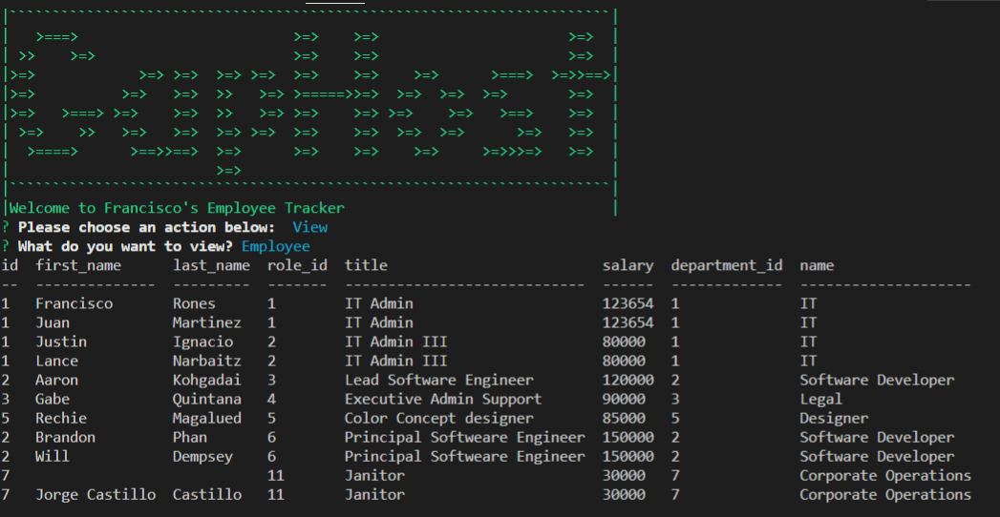
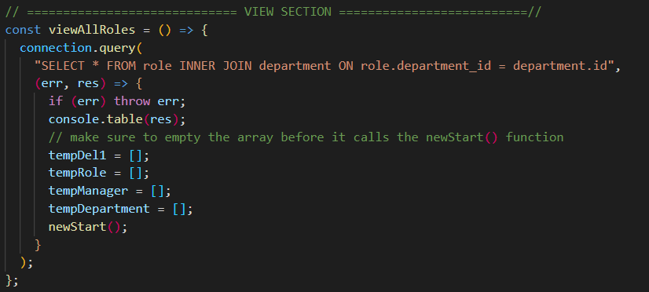
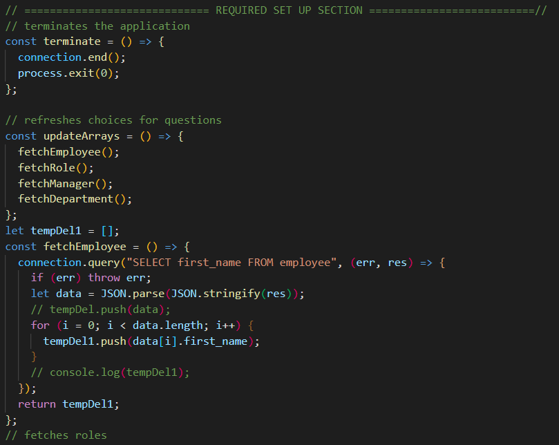
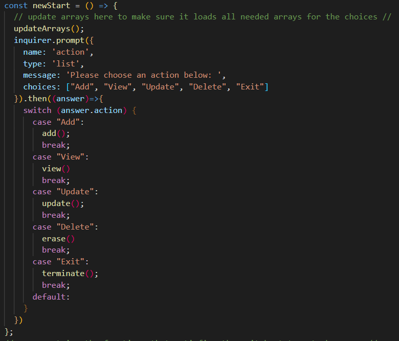

# GapHost Employee Tracker

### Descritption

This is an app showcasing my knowledge on node and mysql, on here you can add, view update and delete employees on the tracker. I would like to update this to a sequelize project to practice our new topic on sequelize.

### Installation

required installation
all you need is to do is npm install and all the dependencies will be installed

### Usage

This project is use to track employees on your company.  You can Create, Read, Update and Destroy the data encoded.

Created 4 Tables instead of 3 on the instructions.

department table holds the department data.
roles table holds the roles
employee table holds all the employees
lastly the one I added here is manager table.

for me it doesnt make sense to have a web developer be a manager in their department and be a manager for sales as well.
So in default here if you add a manager it ask what deparment the manager will be managing and will automatically be the manager for the whole department, so if you add a manager to the IT department regarding what role you are in IT you all will have the same manager on your team.

### Table of Contents

  [Description](###Descritption)

  [Installation](###Installation)

  [Usage](###Usage)

  [License](###License)

  [Contributing](###Contributions)

  [Tests](###Tests)

### License

License under [MIT License](License)

### Contributions

none

### Tests

none

### Questions and Suggestions

Feel free to check out my Github:

[github.com/francisN21](https://github.com/francisN21)

You can reach out to me for questions and suggestions at ininorones@gmail.com
